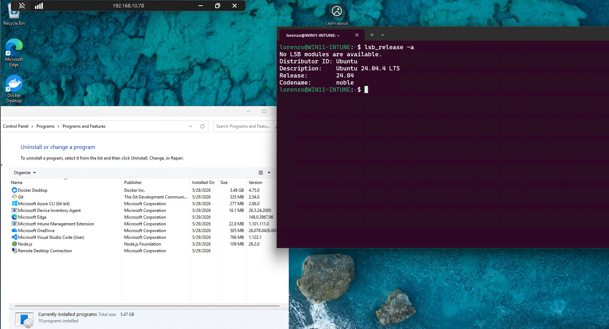
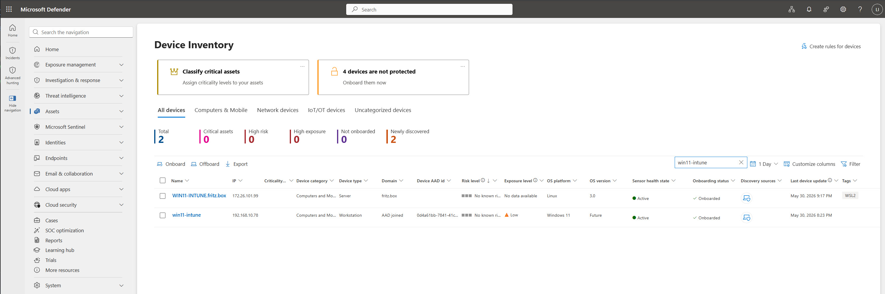
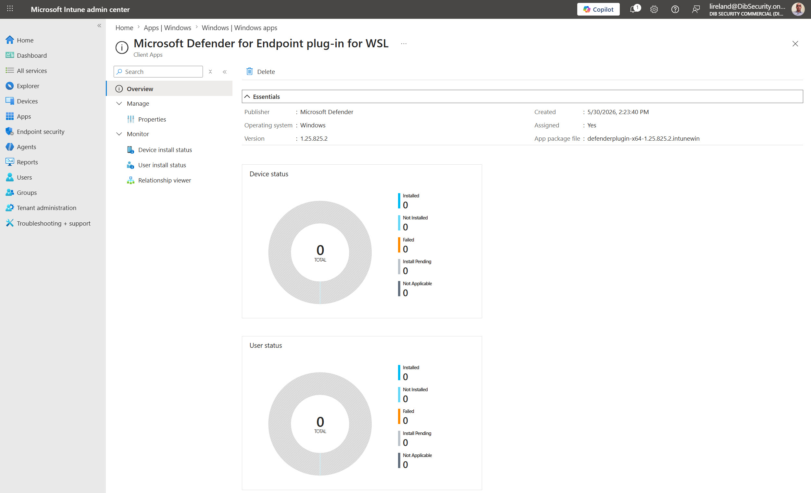
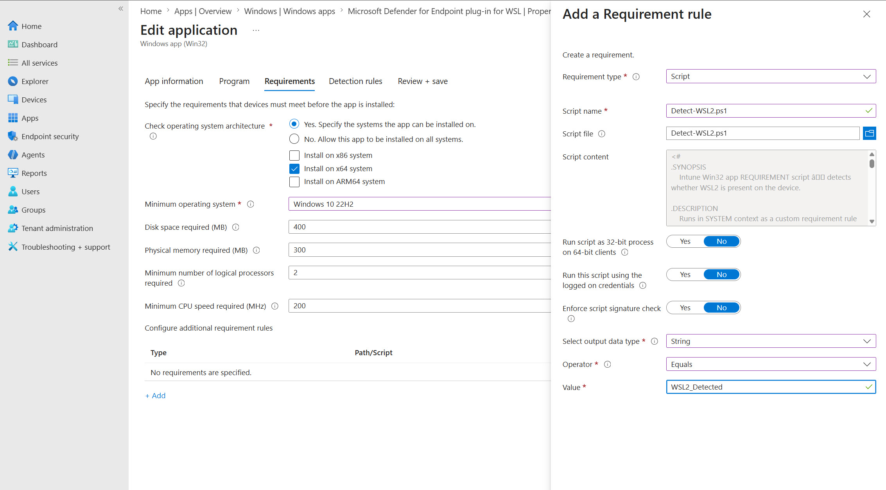
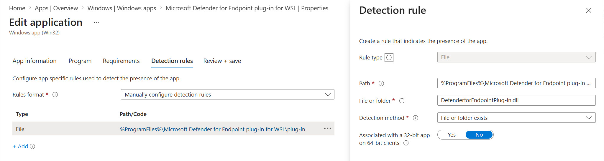
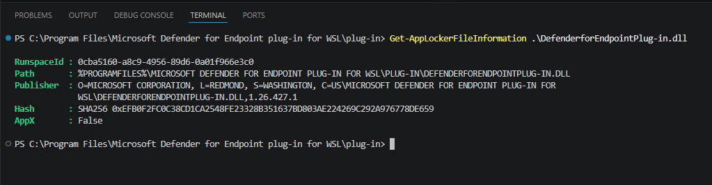
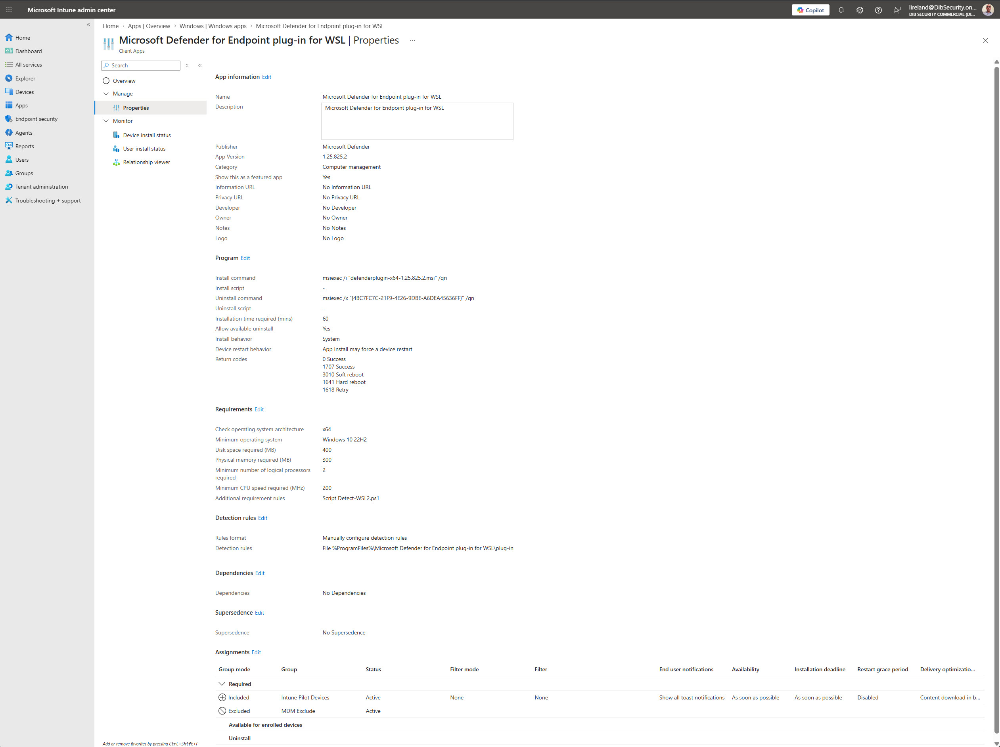
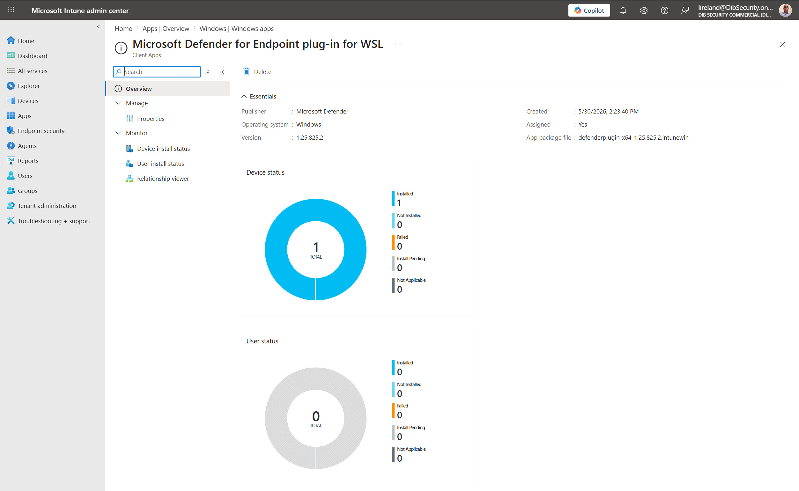
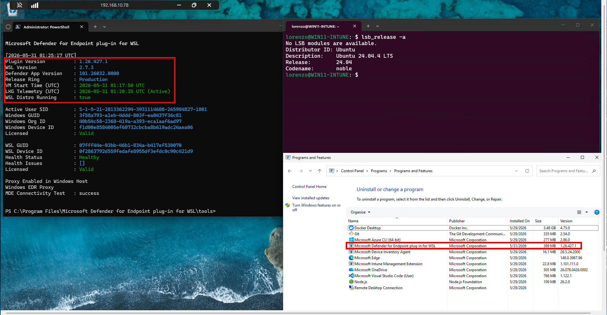
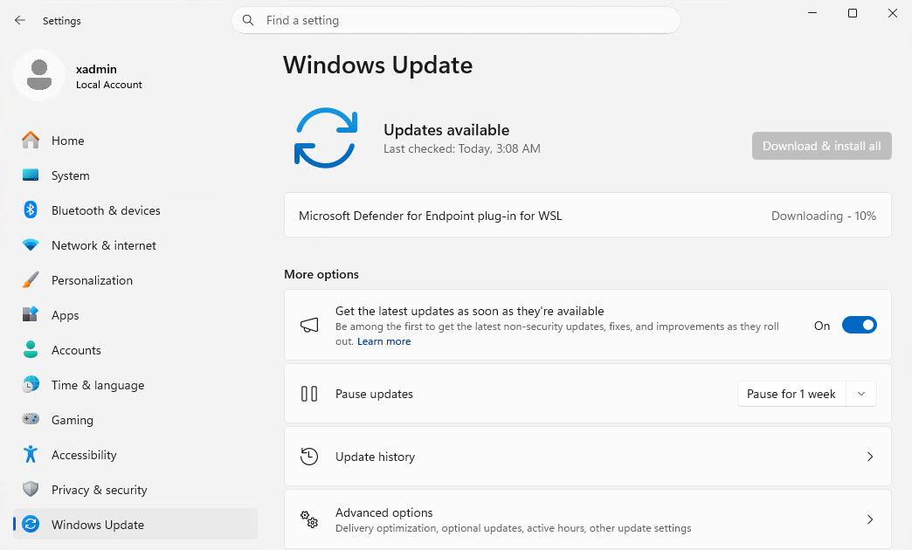

# Microsoft Defender for Endpoint WSL2 Plug-in Deployment with Intune

This repository shows how to deploy the Microsoft Defender for Endpoint plug-in for Windows Subsystem for Linux 2 (WSL2) as a Windows Win32 app in Microsoft Intune.

The goal: If a Windows endpoint has WSL2 installed, Intune should install the Defender for Endpoint WSL plug-in. If the endpoint does not have WSL2, the app should stay not applicable.

## Why this is necessary

WSL2 runs Linux distributions inside an isolated, lightweight virtual machine. A Windows device can be fully onboarded to Microsoft Defender for Endpoint while the Linux environment inside WSL2 remains a visibility gap unless the Microsoft Defender for Endpoint plug-in for WSL is installed.

The example captured here started with a Windows 11 Intune-enrolled system named `WIN11-INTUNE` that had:

- Microsoft Defender for Endpoint sensor active on the Windows host.
- WSL2 installed and running Ubuntu 24.04 LTS.
- No Microsoft Defender for Endpoint plug-in for WSL installed.



After adding this Win32 app deployment to Intune, WSL2 devices receive the plug-in and the WSL environment appears in Microsoft Defender as a Linux logical device tagged `WSL2`.



## How the solution works

The deployment uses Intune's Win32 app model with a custom requirement script:

| Component | Purpose |
| --- | --- |
| Win32 app package | Delivers the Microsoft Defender for Endpoint WSL plug-in MSI as an `.intunewin` app. |
| Custom requirement script | Makes the app applicable only when WSL2 is present and the Windows host is onboarded to Defender for Endpoint. |
| File detection rule | Tells Intune the plug-in is installed by checking for the stable plug-in DLL path. |
| Required assignment | Pushes the app to the targeted device group. |
| Optional inventory scripts | Report the installed plug-in version through Intune remediation inventory. |

The key file is [scripts/Detect-WSL2.ps1](scripts/Detect-WSL2.ps1). In Intune, it is used as a custom requirement rule. It emits the exact string `WSL2_Detected` only when the device has WSL evidence and the host Defender for Endpoint sensor is ready.

## Repository layout

```text
.
|-- README.md
|-- Intune-Build-Checklist.md
|-- images/
|   |-- intune_win32App_mde_wsl2_plugin_policy_completely_defined.jpg
|   |-- intune_win32App_mde_wsl2_plugin_policy_defined_after_install.jpg
|   |-- intune_win32App_mde_wsl2_plugin_policy_defined_before_install.jpg
|   |-- intune_win32App_mde_wsl2_plugin_policy_defined_detection_rule_msi_thumbprint_policy.jpg
|   |-- intune_win32App_mde_wsl2_plugin_policy_defined_detection_rule_policy.jpg
|   |-- intune_win32App_mde_wsl2_plugin_policy_defined_requirement_rule_policy.jpg
|   |-- win11-intune_vm_before_mde_wsl2_plugin_install.jpg
|   |-- win11-update_mde_wsl2_latest_plugin_install.jpg
|   |-- win11-vm_mde_wsl2_plugin_installed_from_intune_app_policy.jpg
|   `-- xdr_defender_mde_assets_windows_and_wsl_installed.jpg
`-- scripts/
    |-- Detect-WSL2.ps1
    |-- Inventory-MDEWSLPluginVersion.ps1
    `-- Remediate-MDEWSLPluginVersion-NoOp.ps1
```

This public repository intentionally does not include assessment documents, tenant-specific evidence reports, local secrets, the downloaded MSI, `IntuneWinAppUtil.exe`, or generated `.intunewin` files.

## Prerequisites

- Microsoft Intune administrator access, or equivalent app-management permissions.
- Target Windows devices enrolled in Intune.
- Windows 10 version 2004 or later, or Windows 11, on x64 hardware.
- Microsoft Defender for Endpoint Plan 2, with the Windows host onboarded.
- WSL version `2.0.7.0` or later, with at least one active WSL2 distribution.
- A Microsoft Entra device group for the required assignment.
- For virtual machines, nested virtualization must be enabled before WSL2 can work.

Useful endpoint checks:

```powershell
wsl --version
wsl --list --verbose
sc.exe query Sense
```

Inside Ubuntu or another WSL distro, this confirms the distro release:

```bash
lsb_release -a
```

## Step 1: Download the Defender for Endpoint WSL plug-in

Download the MSI from the Microsoft Defender portal:

1. Open <https://security.microsoft.com>.
2. Go to **Settings > Endpoints > Onboarding**.
3. Choose **Windows Subsystem for Linux 2 (plug-in)** as the operating system.
4. Download `DefenderPlugin-x64-<version>.msi`.

Keep the MSI in a clean local source folder. Do not commit the MSI to this public repo.

## Step 2: Package the MSI as an Intune Win32 app

Download the Microsoft Win32 Content Prep Tool from the official GitHub repository:

- <https://github.com/microsoft/Microsoft-Win32-Content-Prep-Tool/releases>

Put only the Defender plug-in MSI in the source folder, then create the `.intunewin` package. Use the exact MSI file name you downloaded, or rename the MSI locally and use that renamed file consistently in the package and install command.

```powershell
$PluginMsi = 'DefenderPlugin-x64-1.25.825.2.msi'
.\IntuneWinAppUtil.exe -c C:\IntuneSource\MDE-WSL-Plugin -s $PluginMsi -o C:\IntuneOutput
```

The output is a generated `.intunewin` package that you upload to Intune. Do not commit generated `.intunewin` packages to this public repo.

## Step 3: Create the Windows Win32 app in Intune

In the Microsoft Intune admin center, go to **Apps > Windows > Windows apps > Add > Windows app (Win32)** and upload the `.intunewin` package.



Use app information similar to this:

| Field | Value |
| --- | --- |
| Name | `Microsoft Defender for Endpoint plug-in for WSL` |
| Publisher | `Microsoft Defender` |
| Category | Security, or your local standard |
| Description | Installs the Microsoft Defender for Endpoint plug-in for WSL2 on Windows devices where WSL2 is present. |

### Program

Use silent MSI commands. The MSI name must match the file name packaged into the `.intunewin` file.

```text
Install command:    msiexec /i "DefenderPlugin-x64-<version>.msi" /qn /norestart
Uninstall command:  msiexec /x "DefenderPlugin-x64-<version>.msi" /qn /norestart
Install behavior:   System
Restart behavior:   No specific action
```

### Requirements

Set the built-in requirements first:

```text
Operating system architecture: x64
Minimum operating system:      Windows 10 2004 or your supported Windows 11 baseline
```

Then add a custom script requirement using [scripts/Detect-WSL2.ps1](scripts/Detect-WSL2.ps1):

```text
Run script as 32-bit process on 64-bit clients: No
Enforce script signature check:                No
Select output data type:                       String
Operator:                                      Equals
Value:                                         WSL2_Detected
```



This is the part that makes the app WSL-aware. The requirement script returns `WSL2_Detected` only when WSL2 is present and the Windows Defender for Endpoint sensor is onboarded and running. Devices without WSL2 are not applicable, so they do not receive the plug-in.

### Detection Rules

Use a file detection rule instead of a fixed MSI product code. The plug-in can be serviced through Windows Update, and product codes can change across major upgrade servicing. The DLL path is more stable.

```text
Rule type:        File
Path:             %ProgramFiles%\Microsoft Defender for Endpoint plug-in for WSL\plug-in
File or folder:   DefenderforEndpointPlug-in.dll
Detection method: File or folder exists
```



The MSI product code detection screenshot is kept as a reference for what not to rely on long-term:



### Assignments

Assign the Win32 app as **Required** to a device group. The custom requirement script handles WSL2 applicability inside that target population.



## Step 4: Validate Intune installation

After the next Intune Management Extension check-in, the device install status should move from zero installs to an installed device count.



On the endpoint, confirm the plug-in exists:

```powershell
Test-Path "$env:ProgramFiles\Microsoft Defender for Endpoint plug-in for WSL\plug-in\DefenderforEndpointPlug-in.dll"
```

Then run the health check tool:

```powershell
wsl
Set-Location "$env:ProgramFiles\Microsoft Defender for Endpoint plug-in for WSL\tools"
.\healthcheck.exe
```

If the health check says `Waiting for telemetry` or asks you to launch a WSL distro, start WSL, wait about five minutes, and run the health check again.



Windows Update can service the plug-in after installation, so keep the Intune detection rule based on the plug-in DLL path instead of a fixed MSI product code.



## Step 5: Validate Microsoft Defender visibility

After the plug-in initializes, the WSL2 instance should appear in Microsoft Defender as a Linux logical device. Microsoft notes that this can take up to 30 minutes.

In the Defender portal, go to **Assets > Devices** and filter by the host name or the `WSL2` tag.


You can also use Advanced Hunting to find Windows devices with WSL evidence that do not yet show the WSL plug-in in software inventory:

```kql
let WSLDevices =
    DeviceProcessEvents
    | where ActionType == "ProcessCreated"
    | where ProcessVersionInfoOriginalFileName == "wsl.exe"
        and ProcessVersionInfoFileDescription has "Windows Subsystem for Linux"
    | summarize by DeviceName;
WSLDevices
| join kind=leftanti (
    DeviceTvmSoftwareInventory
    | where SoftwareName has "microsoft_defender_for_endpoint_plug-in_for_wsl"
    | summarize by DeviceName
) on DeviceName
```

## Optional inventory scripts

The [scripts](scripts) directory also contains an inventory-only Intune remediation pair:

- [scripts/Inventory-MDEWSLPluginVersion.ps1](scripts/Inventory-MDEWSLPluginVersion.ps1) reports whether the plug-in is installed and emits the discovered version as compact JSON.
- [scripts/Remediate-MDEWSLPluginVersion-NoOp.ps1](scripts/Remediate-MDEWSLPluginVersion-NoOp.ps1) is a no-op remediation script for tenants that require a paired remediation file.

The Win32 app is the recommended install vehicle because Intune handles content delivery, detection, retries, and app reporting natively. Use the inventory scripts when you want recurring visibility into installed plug-in versions.

## Common issues

- The wrong MSI was packaged. `DefenderPlugin-x64-<version>.msi` is the Defender security plug-in. `IntuneWSLPluginInstaller.msi` is the separate Intune WSL compliance plug-in.
- WSL was installed but no distro has ever been launched. Launch the distro once so registration and telemetry are available.
- WSL version is older than `2.0.7.0`. Run `wsl --update`.
- The Windows host is not onboarded to Defender for Endpoint or the `Sense` service is not running. The requirement script intentionally blocks install until the host MDE sensor is ready.
- A custom WSL kernel is configured. Microsoft does not support the Defender for Endpoint WSL plug-in with custom WSL kernels.
- MSI product code detection was used. Prefer the plug-in DLL file detection rule because Windows Update servicing can change MSI product codes.

## References

- [Microsoft Defender for Endpoint plug-in for Windows Subsystem for Linux](https://learn.microsoft.com/en-us/defender-endpoint/mde-plugin-wsl)
- [What is the Windows Subsystem for Linux?](https://learn.microsoft.com/en-us/windows/wsl/about)
- [How to install Linux on Windows with WSL](https://learn.microsoft.com/en-us/windows/wsl/install)
- [Win32 app management in Microsoft Intune](https://learn.microsoft.com/en-us/intune/app-management/deployment/win32)
- [Prepare Win32 app content for upload](https://learn.microsoft.com/en-us/intune/app-management/deployment/create-win32-package)
- [Add, assign, and monitor a Win32 app in Microsoft Intune](https://learn.microsoft.com/en-us/intune/app-management/deployment/add-win32)
- [Microsoft Win32 Content Prep Tool](https://github.com/microsoft/Microsoft-Win32-Content-Prep-Tool)
- [Manage WSL settings with Microsoft Intune](https://learn.microsoft.com/en-us/windows/wsl/intune)
